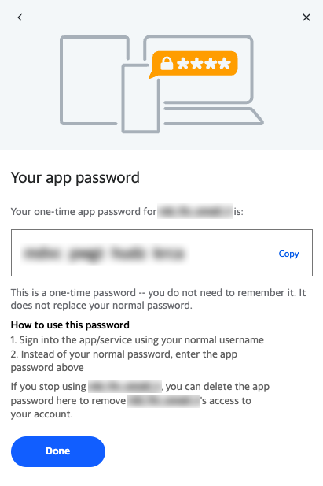

# learn_imap_yahoo.py

Simple python script to open a Yahoo email account and list the folders and the number of message in each folder.

## Installation

### 1. Generate Yahoo Application Password

You will need to generate an application password to access your Yahoo email account. Go to [Yahoo](https://help.yahoo.com/kb/SLN15241.html) and follow the steps there. You will generate a 16-char lowercase string application password - something like "ndvcpwgthudzkrdb".



### 2. Add Environment Variables

You will need to set two environment variables to log into your Yahoo account.

```bash
% export YAHOO_USER=`echo -n "yourname@yahoo.com" | base64`
% export YAHOO_PW=`echo -n "ndvcpwgthudzkrdb" | base64`
```

You can test they are set up properly by running these commands.

```bash
% echo $YAHOO_USER | base64 --decode
yourname@yahoo.com%

% echo $YAHOO_PW | base64 --decode
ndvcpwgthudzkrdb%
```
_Ignore the trailing "%" in the response -- I am not sure why that is there but it is ok to ignore._ 

### 3. Download the script

* Go to [https://github.com/mjbundschuh/learn_imap_yahoo] 
* Select the script


* Select a destination. 


_In this example, I chose my $HOME/Applications folder to store the script. This folder is in my $PATH_

### 4. Run the script

Go to your Applications folder and run python on the script

```bash
% cd ~/Applications
% python learn_imap_yahoo.py

Mailbox : yourname@yahoo.com

           FOLDER : MESSAGES
----------------- : --------
           "Bulk" :       96
          "Inbox" :      292
          "Notes" :       10
"Notes/Subfolder" :        1
           "Sent" :      204
          "Trash" :       71
```

## Testing and Assumptions

* This program was tested on a Macbook Air using iTerm2 (a better alternative to the terminal)
* You should be using Python3 and it should be in your PATH when you run this program
* You know how to use a terminal and command-line commands
* I use base64 encoded environment variables to hold the username and application password. This is useful for running this program in a given user's environment but it is not true encryption. *Be sure to protect your passwords carefully!*

## Supporting Documentation

* [Yahoo IMAP Server Settings](https://help.yahoo.com/kb/SLN4075.html)


## License

[MIT](https://choosealicense.com/licenses/mit/)
